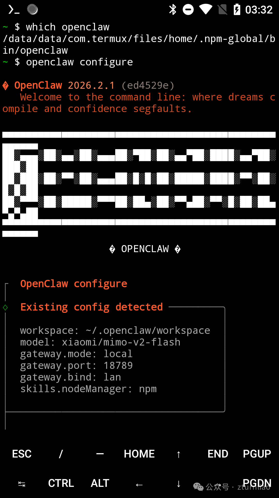

# Openclaw Termux 一键部署脚本

> 🦞 在 Android Termux 环境下一键部署 Openclaw，让您在移动设备上轻松运行 AI 网关服务

[](LICENSE)
[](https://termux.com/)
[](https://nodejs.org/)
[](README.en.md)
[](README.md)



[更多预览图](https://mp.weixin.qq.com/s/KASWkkuD2-Q5f22FDQ7bNA)

## 📖 目录

- [项目简介](#项目简介)
- [功能特性](#功能特性)
- [系统要求](#系统要求)
- [快速开始](#快速开始)
- [详细使用](#详细使用)
- [配置说明](#配置说明)
- [常用命令](#常用命令)
- [故障排除](#故障排除)
- [卸载指南](#卸载指南)
- [技术细节](#技术细节)
- [常见问题](#常见问题)
- [贡献指南](#贡献指南)
- [许可证](#许可证)

---

## 项目简介

Openclaw 是一个强大的 AI 网关服务，本脚本专门为在 Android Termux 环境中部署 Openclaw 而设计。通过自动化安装流程，解决了 Termux 环境下的诸多兼容性问题，包括：

- ✅ 自动检查并安装所有必要的依赖包
- ✅ 自动应用 Android 兼容性补丁（日志路径、剪贴板等）
- ✅ 配置 NPM 全局环境和镜像源
- ✅ 设置 Termux 唤醒锁防止休眠
- ✅ 使用 tmux 实现后台持久运行
- ✅ 提供便捷的别名命令管理服务

---

## 功能特性

### 🚀 一键部署

```bash
curl -sL https://s.zhihai.me/openclaw > openclaw-install.sh && bash openclaw-install.sh
```

### 🔧 自动化配置

- **依赖检查**：自动检测并安装 Node.js、Git、CMake 等必要组件
- **版本验证**：确保 Node.js 版本 ≥ 22
- **镜像加速**：自动配置 NPM 镜像源为国内镜像
- **兼容性补丁**：
  - 修复 Logger 路径（`/tmp/openclaw` → `$HOME/openclaw-logs`）
  - 修复剪贴板模块（Termux 环境兼容）
  - 创建 `/tmp` 符号链接

### 💪 高可用性

- **唤醒锁**：自动激活 Termux 唤醒锁，防止系统休眠
- **后台运行**：使用 tmux 实现服务持久化
- **自动重启**：提供一键重启命令
- **日志管理**：实时日志记录和查看

### 🛡️ 安全机制

- **Token 认证**：支持自定义访问 Token
- **端口配置**：可自定义 Gateway 端口
- **SSH 服务**：可选自动启动 SSHD

### 📊 监控与管理

- **实时日志**：通过 `oclog` 命令查看运行状态
- **服务控制**：提供启动、停止、重启快捷命令
- **详细日志**：完整的安装和运行日志记录

---

## 系统要求

| 组件 | 要求 |
|------|------|
| **操作系统** | Android 7.0+ |
| **Termux** | 最新版本（推荐通过 F-Droid 安装） |
| **Node.js** | ≥ 22.0.0（脚本会自动检查） |
| **存储空间** | ≥ 500MB 可用空间 |
| **内存** | ≥ 2GB RAM 推荐 |
| **网络** | 稳定的网络连接（用于下载依赖） |

### Termux 组件要求

脚本会自动安装以下 Termux 组件（如果未安装）：

- `nodejs` - Node.js 运行时
- `git` - 版本控制工具
- `openssh` - SSH 客户端/服务端
- `tmux` - 终端复用器
- `termux-api` - Termux API 扩展
- `termux-tools` - Termux 工具集
- `cmake` - 构建工具
- `python` - Python 解释器
- `golang` - Go 语言支持

---

## 快速开始

### 方法一：在线安装（推荐）

```bash
curl -sL https://s.zhihai.me/openclaw > openclaw-install.sh && bash openclaw-install.sh
```

### 方法二：本地运行

```bash
# 1. 克隆或下载脚本
git clone https://github.com/yourusername/install-openclaw-on-termux.sh.git
cd install-openclaw-on-termux.sh

# 2. 运行安装脚本
bash install-openclaw-termux.sh
```

### 交互式配置

安装过程中，脚本会提示您输入以下配置：

```
请输入 Gateway 端口号 [默认: 18789]: 
请输入自定义 Token (用于安全访问，建议强密码) [留空随机生成]: 
是否需要开启开机自启动? (y/n) [默认: y]: 
```

**推荐配置**：
- 端口：使用默认 `18789` 或自定义
- Token：**建议手动输入强密码**，或让脚本生成随机 Token
- 自启动：初次安装推荐 `y`，后续可通过脚本修改

---

## 详细使用

### 命令行选项

```bash
bash install-openclaw-termux.sh [选项]
```

| 选项 | 简写 | 说明 |
|------|------|------|
| `--help` | `-h` | 显示帮助信息 |
| `--verbose` | `-v` | 启用详细输出，显示每个执行的命令 |
| `--dry-run` | `-d` | 模拟运行模式，不执行实际命令（用于测试） |
| `--uninstall` | `-u` | 卸载 Openclaw 并清理配置 |

### 使用示例

```bash
# 标准安装
bash install-openclaw-termux.sh

# 详细输出模式安装
bash install-openclaw-termux.sh --verbose

# 模拟运行（不实际安装）
bash install-openclaw-termux.sh --dry-run

# 卸载 Openclaw
bash install-openclaw-termux.sh --uninstall

# 组合使用
bash install-openclaw-termux.sh -v -d  # 详细模式 + 模拟运行
```

### 安装流程

脚本将依次执行以下 6 个步骤：

```
[1/6] 正在检查基础运行环境...
      ↓
[2/6] 正在配置 Openclaw...
      ↓
[3/6] 正在应用 Android 兼容性补丁...
      ↓
[4/6] 激活唤醒锁...
      ↓
[5/6] 启动服务...
      ↓
[6/6] 部署指令发送完毕
```

---

## 配置说明

### 环境变量

脚本会在 `~/.bashrc` 中添加以下环境变量：

```bash
export TERMUX_VERSION=1                    # Termux 标识
export TMPDIR=$HOME/tmp                     # 临时目录
export OPENCLAW_GATEWAY_TOKEN=your_token    # 访问 Token
export PATH=$HOME/.npm-global/bin:$PATH     # NPM 全局路径
```

### 目录结构

```
$HOME/
├── .bashrc                      # Shell 配置文件（脚本会修改）
├── .bashrc.backup               # bashrc 备份（修改前自动创建）
├── .npm-global/                 # NPM 全局包目录
│   └── bin/                     # NPM 可执行文件目录
│       └── openclaw             # Openclaw 可执行文件
├── openclaw-logs/               # 日志目录
│   ├── install.log             # 安装日志
│   └── runtime.log              # 运行时日志
└── tmp/                         # 临时文件目录
```

### 端口配置

- **默认端口**：`18789`
- **修改方式**：重新运行脚本并输入新端口
- **访问地址**：`http://<设备IP>:<端口>`
- **Token 认证**：需要在请求头中携带 `Authorization: Bearer <token>`

---

## 常用命令

安装完成后，脚本会创建以下快捷别名（如果在 ~/.bashrc 中启用）：

| 别名 | 功能 | 使用示例 |
|------|------|----------|
| `ocr` | **重启服务** | `ocr` |
| `oclog` | **查看日志** | `oclog` |
| `ockill` | **停止服务** | `ockill` |

### 命令详解

#### 1. 重启服务 (`ocr`)

```bash
ocr
```

**功能**：停止现有服务并重新启动 Openclaw Gateway

**内部流程**：
```bash
pkill -9 node                     # 停止所有 Node.js 进程
tmux kill-session -t openclaw     # 销毁 tmux 会话
sleep 1                           # 等待进程清理
tmux new -d -s openclaw           # 创建新的 tmux 会话
tmux send-keys -t openclaw "openclaw gateway --bind lan --port <port> --token <token>" C-m
```

#### 2. 查看日志 (`oclog`)

```bash
oclog
```

**功能**：附加到 tmux 会话，实时查看 Openclaw 运行日志

**快捷键**：
- `Ctrl+B` 然后 `D`：脱离会话（服务继续运行）
- `Ctrl+C`：停止服务（不推荐）

#### 3. 停止服务 (`ockill`)

```bash
ockill
```

**功能**：强制停止 Openclaw 服务

**内部流程**：
```bash
pkill -9 node                     # 停止所有 Node.js 进程
tmux kill-session -t openclaw     # 销毁 tmux 会话
```

### 手动管理命令

如果您不想使用别名，也可以手动执行以下命令：

```bash
# 查看 tmux 会话状态
tmux list-sessions

# 附加到 openclaw 会话
tmux attach -t openclaw

# 脱离当前会话（快捷键：Ctrl+B 然后 D）
tmux detach-client

# 查看实时日志
tail -f $HOME/openclaw-logs/runtime.log
```

---

## 故障排除

### 安装失败

#### 问题 1：Node.js 版本不符合要求

**症状**：
```
错误：Node.js 版本必须 22 以上，当前版本: v20.x.x
```

**解决方案**：
```bash
# 更新 pkg 源
pkg update -y

# 卸载旧版 Node.js
pkg uninstall nodejs

# 安装最新版 Node.js
pkg install nodejs -y

# 验证版本
node -v  # 应显示 v22.x.x 或更高
```

#### 问题 2：pkg update 失败

**症状**：
```
错误：pkg 更新失败
```

**解决方案**：
```bash
# 清理缓存
pkg clean

# 更换源（可选）
# 编辑 $PREFIX/etc/apt/sources.list，使用清华源或阿里源

# 重新更新
pkg update -y
```

#### 问题 3：NPM 镜像设置失败

**症状**：
```
错误：NPM 镜像设置失败
```

**解决方案**：
```bash
# 手动设置镜像
npm config set registry https://registry.npmmirror.com

# 验证
npm config get registry
```

### 服务启动失败

#### 问题 1：tmux 会话启动后立即崩溃

**症状**：
```
❌ 错误：tmux 会话启动后立即崩溃。
请检查报错日志: cat $HOME/openclaw-logs/runtime.log
```

**解决方案**：
```bash
# 查看详细日志
cat $HOME/openclaw-logs/runtime.log

# 常见原因和解决方法：
# 1. 端口被占用 → 更换端口
# 2. Token 无效 → 重新运行脚本设置
# 3. 内存不足 → 关闭其他应用
```

#### 问题 2：termux-wake-lock 激活失败

**症状**：
```
⚠️  Wake-lock 激活失败，可能 termux-api 未正确安装
```

**解决方案**：
```bash
# 安装 termux-api
pkg install termux-api -y

# 检查 Termux 应用权限
# 设置 → 权限 → 禁用电池优化 → 允许 Termux

# 重新激活唤醒锁
termux-wake-lock
```

#### 问题 3：无法连接到 Gateway

**症状**：
```bash
curl: Connection refused
```

**解决方案**：
```bash
# 1. 检查服务是否运行
tmux list-sessions

# 2. 检查端口是否监听
netstat -tuln | grep <port>

# 3. 检查防火墙（部分 Android 设备）
# 4. 确认使用正确的 IP 地址
ip addr show wlan0

# 5. 重启服务
ocr
```

### 性能问题

#### 问题 1：设备发热严重

**解决方案**：
```bash
# 1. 限制 CPU 使用率（如果支持）
# 2. 降低 Gateway 并发数
# 3. 使用 `oclog` 查看是否有异常请求

# 查看资源使用
top -m 10
```

#### 问题 2：响应速度慢

**解决方案**：
```bash
# 1. 检查网络连接
ping -c 4 8.8.8.8

# 2. 查看日志排查瓶颈
oclog

# 3. 清理系统缓存
pkg clean
```

### 日志查看

```bash
# 安装日志
cat $HOME/openclaw-logs/install.log

# 运行时日志
cat $HOME/openclaw-logs/runtime.log

# 实时跟踪日志
tail -f $HOME/openclaw-logs/runtime.log

# 查看最近 50 行
tail -n 50 $HOME/openclaw-logs/runtime.log
```

---

## 卸载指南

### 方法一：使用脚本卸载

```bash
bash install-openclaw-termux.sh --uninstall
```

**卸载内容**：
- ✅ 停止 Openclaw 服务
- ✅ 删除 ~/.bashrc 中的 Openclaw 配置
- ✅ 卸载 Openclaw NPM 包
- ✅ 删除日志目录 `$HOME/openclaw-logs`
- ✅ 删除 NPM 全局目录 `$HOME/.npm-global`
- ✅ 清理临时文件

**保留内容**：
- ✅ Bashrc 备份文件（可手动恢复）

### 方法二：手动卸载

```bash
# 1. 停止服务
pkill -9 node
tmux kill-session -t openclaw

# 2. 删除 bashrc 配置
sed -i '/# --- Openclaw Start ---/,/# --- Openclaw End ---/d' ~/.bashrc
sed -i '/export PATH=.*\.npm-global\/bin/d' ~/.bashrc

# 3. 卸载 Openclaw
npm uninstall -g openclaw

# 4. 删除目录
rm -rf ~/openclaw-logs
rm -rf ~/.npm-global

# 5. 重新加载 bashrc
source ~/.bashrc
```

---

## 技术细节

### 脚本架构

```
install-openclaw-termux.sh
├── 参数解析 (parse arguments)
│   ├── --verbose, -v
│   ├── --dry-run, -d
│   ├── --uninstall, -u
│   └── --help, -h
├── 核心函数 (core functions)
│   ├── check_deps()          # 检查依赖
│   ├── configure_npm()       # 配置 NPM
│   ├── apply_patches()       # 应用补丁
│   ├── setup_autostart()     # 配置自启动
│   ├── activate_wakelock()   # 激活唤醒锁
│   ├── start_service()       # 启动服务
│   └── uninstall_openclaw() # 卸载函数
├── 辅助函数 (helper functions)
│   ├── log()                 # 日志记录
│   └── run_cmd()             # 命令执行
└── 主流程 (main execution)
    ├── 环境初始化
    ├── 交互配置
    └── 步骤执行
```

### 兼容性补丁详解

#### 1. Logger 补丁

**问题**：Openclaw 默认使用 `/tmp/openclaw` 作为日志目录，但 Termux 的 `/tmp` 可能不存在或不可写。

**解决方案**：
```javascript
// 替换前
/tmp/openclaw

// 替换后
$HOME/openclaw-logs
```

**实现**：
```bash
node -e "const fs = require('fs'); const file = '$LOGGER_FILE'; 
let c = fs.readFileSync(file, 'utf8'); 
c = c.replace(/\/tmp\/openclaw/g, process.env.HOME + '/openclaw-logs'); 
fs.writeFileSync(file, c);"
```

#### 2. 剪贴板补丁

**问题**：`@mariozechner/clipboard` 模块依赖原生 C++ 模块，在 Termux 中编译失败。

**解决方案**：使用 mock 对象替换原始剪贴板模块。

**实现**：
```bash
node -e "const fs = require('fs'); const file = '$CLIP_FILE'; 
const mock = 'module.exports = { 
  availableFormats:()=>[], 
  getText:()=>\"\", 
  setText:()=>false, 
  // ... 其他方法
};'; 
fs.writeFileSync(file, mock);"
```

### 错误处理机制

```bash
# 全局错误捕获
trap 'echo -e "${RED}错误：脚本执行失败，请检查上述输出${NC}"; exit 1' ERR

# 严格模式
set -e          # 遇到错误立即退出
set -o pipefail # 管道中任何命令失败都视为失败

# 每步错误检查
if [ $? -ne 0 ]; then
    log "操作失败"
    echo -e "${RED}错误：操作失败${NC}"
    exit 1
fi
```

### 日志系统

```bash
# 日志目录结构
$HOME/openclaw-logs/
├── install.log    # 安装过程日志
└── runtime.log    # 运行时日志（由 Openclaw 生成）

# 日志格式
YYYY-MM-DD HH:MM:SS [日志内容]

# 日志级别
- INFO: 一般信息
- WARNING: 警告信息
- ERROR: 错误信息
```

---

## 常见问题

<details>
<summary><b>Q1: 为什么需要 Node.js ≥ 22？</b></summary>

Openclaw 依赖最新的 JavaScript 特性和原生模块，Node.js 22 引入了以下关键改进：
- 更好的 ES 模块支持
- 改进的 V8 引擎性能
- 原生模块 ABI 兼容性
- 安全性增强

Termux 默认安装的 Node.js 版本可能较低，因此脚本会强制检查并提示升级。
</details>

<details>
<summary><b>Q2: 脚本修改了 ~/.bashrc，会影响其他配置吗？</b></summary>

不会。脚本会在修改前自动创建备份文件 `~/.bashrc.backup`。所有添加的配置都包含在明确的标记内：

```bash
# --- Openclaw Start ---
...
# --- OpenClaw End ---
```

卸载时，脚本会自动删除这些配置并可选择恢复原始 bashrc。
</details>

<details>
<summary><b>Q3: 如何在多个设备上使用同一个脚本？</b></summary>

脚本完全支持多设备部署，每个设备的配置（端口、Token）是独立的：

1. 在每个设备上单独运行脚本
2. 为每个设备设置不同的端口或 Token
3. 使用相同的命令管理服务

**注意**：如果所有设备在同一局域网内，请确保使用不同的端口避免冲突。
</details>

<details>
<summary><b>Q4: 可以更换 NPM 镜像源吗？</b></summary>

可以。脚本默认使用淘宝镜像 `https://registry.npmmirror.com`，您可以手动修改：

```bash
# 查看当前镜像
npm config get registry

# 更换为其他镜像（例如官方源）
npm config set registry https://registry.npmjs.org

# 或使用其他国内源
# 华为云
npm config set registry https://mirrors.huaweicloud.com/repository/npm/
# 腾讯云
npm config set registry https://mirrors.cloud.tencent.com/npm/
```
</details>

<details>
<summary><b>Q5: 服务崩溃后如何自动重启？</b></summary>

当前版本使用 tmux 保持服务运行，但不会自动重启。您可以使用以下方法实现自动重启：

**方法一：使用循环脚本**
```bash
while true; do
  openclaw gateway --bind lan --port <port> --token <token>
  sleep 5
done
```

**方法二：使用 systemd（Termux:Boot）**
```bash
# 安装 Termux:Boot
pkg install termux-boot

# 创建启动脚本
cat > ~/.termux/boot/openclaw.sh << EOF
#!/bin/bash
tmux new -d -s openclaw 'openclaw gateway --bind lan --port <port> --token <token>'
EOF
chmod +x ~/.termux/boot/openclaw.sh
```
</details>

<details>
<summary><b>Q6: 如何查看 Openclaw 的版本和配置？</b></summary>

```bash
# 查看 Openclaw 版本
openclaw --version

# 查看 Gateway 配置
openclaw gateway --help

# 查看当前运行的服务
openclaw status
```
</details>

<details>
<summary><b>Q7: Termux 前台时服务运行正常，后台时停止运行？</b></summary>

这是 Android 的电池优化机制导致的。解决方法：

1. **禁用电池优化**：
   - 设置 → 应用管理 → Termux → 电池 → 取消电池优化

2. **激活唤醒锁**（脚本已自动执行）：
   ```bash
   termux-wake-lock
   ```

3. **添加到白名单**：
   - 部分手机需要在系统设置中将 Termux 添加到后台运行白名单

4. **使用 Termux:Boot**：
   ```bash
   pkg install termux-boot
   ```
</details>

<details>
<summary><b>Q8: 如何备份和迁移 Openclaw 配置？</b></summary>

```bash
# 备份配置
mkdir -p ~/openclaw-backup
cp ~/.bashrc ~/openclaw-backup/
cp -r ~/.npm-global ~/openclaw-backup/

# 迁移到新设备
# 1. 将 backup 目录传输到新设备
# 2. 恢复配置
cp ~/openclaw-backup/.bashrc ~/.bashrc
cp -r ~/openclaw-backup/.npm-global ~/.npm-global

# 3. 重新运行脚本
bash install-openclaw-termux.sh
```
</details>

---

## 贡献指南

欢迎贡献代码、报告问题或提出建议！

### 报告问题

在提交 Issue 前，请确认：

1. ✅ 已阅读本文档的"故障排除"部分
2. ✅ 提供详细的错误信息和复现步骤
3. ✅ 附上相关日志（`$HOME/openclaw-logs/runtime.log`）
4. ✅ 说明您的系统环境（Termux 版本、Android 版本、Node.js 版本等）

### 提交代码

1. Fork 本仓库
2. 创建特性分支 (`git checkout -b feature/AmazingFeature`)
3. 提交更改 (`git commit -m 'Add some AmazingFeature'`)
4. 推送到分支 (`git push origin feature/AmazingFeature`)
5. 开启 Pull Request

### 代码规范

- 遵循 ShellCheck 最佳实践
- 添加必要的注释和文档
- 确保在标准 Termux 环境下可运行
- 测试您的更改不会破坏现有功能

---

## 更新日志

### v2.0 (当前版本)

- ✨ 添加命令行选项支持（--verbose, --dry-run, --uninstall）
- ✨ 改进错误处理和日志系统
- ✨ 优化依赖检查和安装流程
- 🐛 修复 Logger 路径补丁验证失败的问题
- 🐛 修复剪贴板模块补丁应用失败的问题
- 📝 完善文档和帮助信息

### v1.0 (初始版本)

- ✨ 基础一键安装功能
- ✨ 依赖检查和安装
- ✨ Android 兼容性补丁
- ✨ tmux 后台运行支持
- ✨ 基础别名命令

---

## 许可证

本项目采用 MIT 许可证 - 详见 [LICENSE](LICENSE) 文件

---

## 致谢

- [Openclaw](https://github.com/openclaw/openclaw) - 核心项目
- [Termux](https://termux.com/) - 强大的 Android 终端模拟器
- Google Gemini
- 所有贡献者和使用者的反馈与支持

---

## 联系方式

- **项目主页**：[GitHub Repository](https://github.com/hillerliao/install-openclaw-on-termux)
- **问题反馈**：[GitHub Issues](https://github.com/hillerliao/install-openclaw-on-termux/issues)
- **邮箱**：riao@zhihai.me
- **微信群**：

    

---

## 赞助支持

如果您觉得这个项目对您有帮助，欢迎通过以下方式支持：

- ⭐ 给项目一个 Star
- 🐛 报告问题或提出建议
- 💡 分享您的使用经验
- 💰 赞助项目发展（可选）

---

<div align="center">

**如果这个项目对您有帮助，请给一个 ⭐️ Star**

Made with ❤️ by the Openclaw Community

</div>
